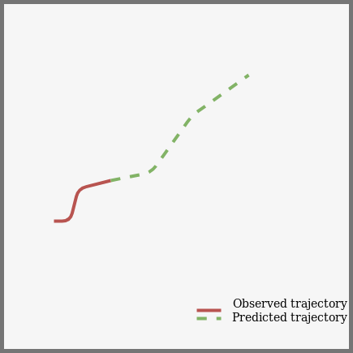
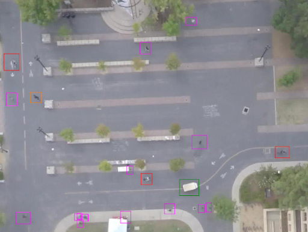
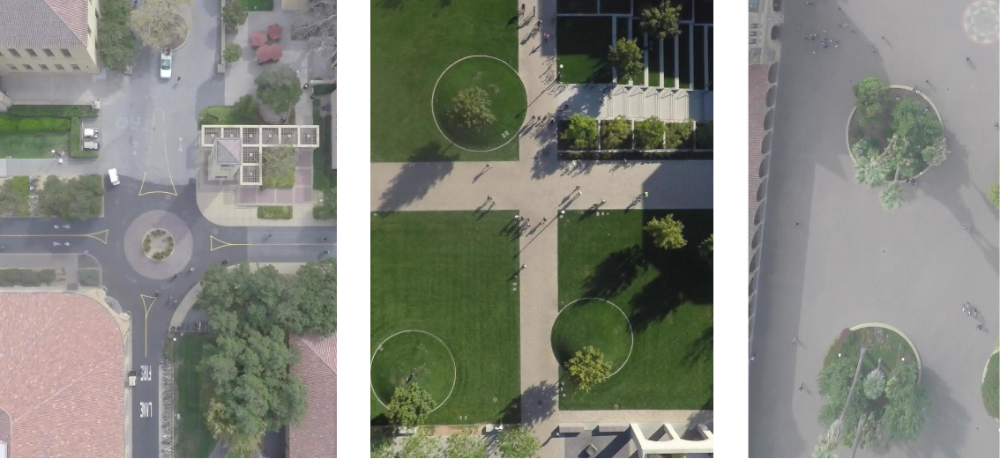
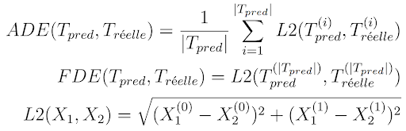
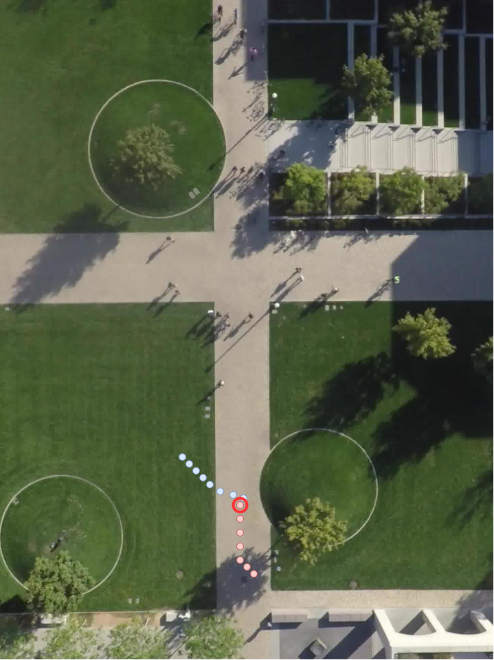
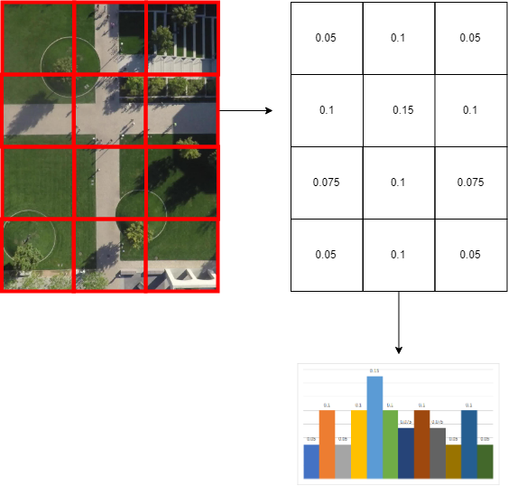

# Study of attention mechanisms for trajectory prediction in Deep Learning
## Overview

### Problem definition
This project addresses the task of predicting future trajectories of interacting agents in a scene. We refer to this problem as trajectory prediction. The trajectory prediction task works as follows: given the past observed trajectory of an agent (pedestrian, cyclist, driver ...) we want to predict the future trajectory of the agent, i.e. the ordered next positions it will cross in the future. In the litterature, the prediction task is commonly tackled for 8 observed positions and 12 predicted positions. The time between two positions being 0.4s, we observe an agent moving during 3.2s and predict its movement for the next 4.8s.

</img>

#### Naïve prediction
We refer to this task as naïve prediction when the only information used to predict an agent's future path is its past observed trajectory. This naïve prediction is most of the time tackled using deep learning models such as LSTM-MLP or sequence-to-sequence LSTM. In the sequence-to-sequence LSTM model, the first LSTM (encoder) takes as input the observed trajectory and extracts recursively a fixed-size representation of it. Using this representation, the second LSTM (decoder) predicts recursively the future positions of the agent. By recursively, we mean that it first predicts the next position and then uses it to make the following prediction and so on. 

</img>

It has been shown that predicting recursively the future trajectory leads to an error accumulation along the predicted position. Indeed since the model bases its prediction on previously made predictions, it depends on the error previously made on those. To address this issue, one can use the LSTM-MLP model that replaces de LSTM decoder with a simple Multi Layer Perceptron( MLP) network. This simpler model predicts all the future positions simultaneously getting rid of the error accumulation issue.

</img>

Finally, it's been shown that against all expectations, using a Convolutionnal Neural Network (CNN) along the temporal dimension instead of Recurrent Neural Network (RNN) gives slightly better results when predicting the future trajectory and is way faster due to the fact that convolution operations can be made in parallel whereas operations in an RNN are made sequentially. We refer in this project to this model as CNN-MLP.

</img>

All three models are implemented in this project and referred as seq2seq, rnn-mlp and cnn-mlp.

#### Using the environment
One main research question in this field, is to train a model on a set of scenes and test it on a new set of scenes. In other words, we want a model capable of generalizing its learning across different and unseen environments.

It is obvious that such a challenge can't be overcome using only past observed trajectory as input for our models. In fact, when an agent crosses a scene, the scene has an influence on its motion. The agent interacts with the scene. Mainly two types of interactions are addressed in the litterature:

</img>

Social interactions refer to the influence the interactions between an agent and its surrounding agents have on their motions. 

Spatial interactions refer to the influence between an agent and the physical constraints of a scene (such as roads, trees, obstacles ...) on the agent motion.

A model good enough to generalize knowledge to a new set of scenes should be able to make good use of those interactions.

A whole lot of models have been proposed to use those informations for trajectory prediction. Amongst them, some tried to use attention mechanisms. Attention mechanisms first came from Natural Language Processing (NLP) and were then used in Computer Vision (CV). 

The purpose of such mechanisms is to select automatically, based on the prediction context, which elements from a set of observations are relevant for the current prediction. For instance in NLP, one main task is language translation, which consists in given an input sentence in a language, to output its translation in another language. In this context, the set of elements is made of the words of the input sentence. At prediction time, the words from the output sentence are predicted sequentially. Attention mechanisms come from the observation that for a given predicted word, not every word in the input sentence is relevant. Therefore, attention mechanisms can be used to select which input words are relevant for every predicted word, making it possible to modify the input based on context.

</img>

In trajectory prediction, attention mechanisms are used for taking into account two things: on one hand for social interactions, on the other hand for spatial interactions. In the case of social interactions, attention mechanisms are used to select which agents must be considered from the surrounding of the agent we want to predict the future position (or main agent). In the case of spatial interactions, attention mechanisms are used to select which physical part of the scene (based on a top-view image) might have an impact on the future trajectory of the agent.

### Goals of the project

The main goal of this project was to evaluate the attention mechanisms already used for trajectory prediction. The attention mechanism were transposed somewhat "naïvely" from NLP to trajectory prediction. We modify those models and try to reduce drastically the computing time while keeping the same prediction quality, showing that such transposition was indeed naïve.

While addressing this goal, we started to question the evaluation settings and in particular the relevance of the metrics used to evaluate such models. We therefore try to propose a new set of metrics to enrich the comparison of models.

Finally despite the claims of previous studies, that such models could take into account social and spatial interactions we try to show that it might not be the case (in the continuity of https://arxiv.org/abs/1903.07933?utm_source=feedburner&utm_medium=feed&utm_campaign=Feed%3A+arxiv%2FQSXk+%28ExcitingAds%21+cs+updates+on+arXiv.org%29).

## Study
### Baselines
#### Soft-attention
Previous studies using attention mechanisms for trajectory prediction are based on its soft-attention variant. The soft-attention can be seen as a function A(.,.) of two inputs Q and V_i. Q and V_i are attribute vectors. The function A(Q, V_i) is a feed-forward neural network  whose output is of size 1. Basically, Q and V_i are concatenated and fed in the neural network which outputs a positive real number. In the function, Q embodies the prediction context and V_i is an element for which we want to evaluate the relevance for the next prediction. The ouput S_i of A(Q, V_i) is to be interpreted as the relevance of V_i for the next prediction based on the current prediction context Q. This operation is repeated for every V_i from a set V. The scores are then normalized using a softmax function so that they sum to one. This normalization results in the attention weights W. The attention vector is the weighted sum of attribute vectors V_i by its attention weight W_i. The intuition behind it is that the attention vector contains informations from elements V_i proportionally to their relevance for the coming prediction. This process is differentiable and therefore easy to use with backpropagation in deep learning.

</img>

### The baseline for attentive trajectory prediction

In the litterature, all the models for attentive trajectory prediction are based upon the sequence-to-sequence architecture. First the observed trajectory of the agent we want to predict the next position is fed into an LSTM (the encoder) that extracts automatically a fixed-size attribute vector. This vector is used to initialize the hidden state of another LSTM (the decoder) which will be used to predict the following positions. The hidden state of the decoder represents the prediction context. It is first initialized based on the observed trajectory and then updated gradually as we go along the prediction process. The main difference between the "naïve" sequence-to-sequence model and the attentive one takes place during the prediction part. Before, we were taking as decoder input either the last position of the observed trajectory or the last predicted position and so on recursively. In the attentive alternative, for each prediction, we call the soft-attention module and concatenate the attention vector to the decoder regular input. 

</img>

One thing to notice is that the module is called for every prediction. This comes from the natural language processing use of this model, for instance for language prediction where it is apropos to select the relevant words in the input sentence for every predicted word.
Another thing is that only the first parameter of the attention module changes from one call to another. It is the parameter Q from the previous paragraph, namely the prediction context. The value of the prediction context is the current decoder hidden state. The second parameter, namely the set of element whose relevance is to be evaluated, doesn't change from one call to another.

The only thing that changes between the attentive model for social interactions (social attention) and the attentive model for spatial interactions (spatial attention) is the set of elements V.

#### Set of element for social attention
In social attention we want to give a weight to every pair of (main agent, ith neighbor), main agent being the agent we want to predict the upcoming path and the neighbors being the other agents in the scene during observation time. To that end, every V_i in that context corresponds to the extracted attribute vector (using the same LSTM encoder as before) from the observed trajectory of the ith neighbor.

#### Set of element for spatial attention

In spatial attention we want to give a weight to every pair of (main agent, ith scene part), main agent being the agent we want to predict the upcoming path. To get a spatial representation of the scene, we have a top-view image of the scene (always the same image). We pass it through a CNN, VGG-19 pre-trained on the image-net dataset, resulting in some feature maps. Each feature map corresponds to an attribute vector caracterizing a part of the image (grid-like division of the image). Those vectors are the elements in the set V.

#### Relevance of naïve transposition from NLP

We claim that such a transposition of attention mechanisms from NLP to trajectory prediction is somewhat a naïve one, in that it used very similarly as in NLP without giving much thinking on its relevance for trajectory prediction. Our main observation is based upon the fact that these models compute, for each prediction an attention vector. Yet the set of elements to be considered in the soft-attention module stays the same between every prediction. The only parameter that changes is the context vector given by the hidden state of the decoder. In addition, since we predict a position every 0.4s, it might not be relevant to reassess at this rate the interactions between the main agent and its environment. We want to show that computing the attention vector just once in order to predict the whole future trajectory gives similar results.

### The proposed model to test the claim

The model we propose to back up our claim is very simple. First, we use a CNN to extract useful information from the observed trajectory of the main agent as a feature vector. We are using a CNN since it was shown that it gives better results than LSTM. We then call the soft-attention module on our set of elements using this attribute vector as context. We then concatenate the resulting attention vector and the attribute vector together and feed it into a Feed-Forward Neural Network that predicts simultaneously all the future positions. We make a simultaneous prediction since it has been shown that it allows to get rid of the error accumulation issue of recursive prediction using an LSTM.

</img>

### Evaluation protocol

#### Dataset

We want to evaluate the ability of the described models to take into account social and spatial interactions between an agent and its environment. To that end, we need a dataset where first those interactions actually exist and second those interactions actually have an influence on the way the agents move in scenes. We chose to use the Stanford Drone Dataset (SDD). Its a dataset where trajectories have been extracted from 8 different scenes using video taken from a drone. The scenes have various spatial structure, some of which highly influence agents motion (not only linear path). There are 20K trajectories in this datasets. The providers of the dataset claim that it features 6 different classes of agents such as car drivers, bicyclists, pedestrians and others. But in practice it's mostly pedestrians and bicyclists accounting each for half of the trajectories. 

Along the trajectories, we are given a top-view image of each scene and the types of every agents.

</img>

#### Training samples
There are three types of training samples, the one for naïve approaches, the one for social models and the one for spatial models. The trajectories are expressed in pixel for every scenes. We convert them to the meter space.
##### Naïve samples
For naïve models, every trajectories are split into subtrajectories of 20 subsequent positions. For each one of those, we take as input the first 8 observed positions and use the last 12 as labels. 

As labels, as proposed in the litterature, we don't use absolute positions, but offsets with respect to the last position of the input sub-trajectory.

For the inputs, all positions are expressed in a 2D spatial system where the origin lies at the bottom  left of the (image of the) scene. We normalize the absolute positions across all the scenes using min-max normalization. To that end, we compute the min and max value (x_min and x_max) across all scenes and across both axes. We then normalize every value x (which corresponds to coordinates on either axis) using the following formula:

[insert minmax formula (x- xmin)/(xmax-xmin)]

We do it this way to keep the ratio between both axes, and to keep the proportions between every scenes.

##### Social samples

For social samples, we do the same as for naïve samples regarding the trajectory of the main agent. Since we want to take into account the other agents, we take as input the observed trajectories of all agents present in the scene during the 8 units of time of the main agent observed trajectory. 

For the agents leaving the scene before the end of the observation time, we discard their trajectories. For those entering the scene during the observation time, we deal with it two different ways:

* If the model uses an LSTM to process trajectories, we add zero padding at the beginning of incomplete trajectories for data storing and then ignore those padding points at training time.

* If the model uses a CNN, we add zero padding at the beginning of incomplete trajectories and feed them as is in the CNN since zero values don't have an impact on convolution operation.

##### Spatial samples

For social samples, we do the same as for naïve samples regarding the trajectory of the main agent. In addition, for each sample, we take the top-view image of the corresponding scene and pass it through the convolutionnal part of a pre-trained VGG-19 neural network pretrained on the image net dataset. This yield 49 feature maps, each corresponding to one part of the scene(image).

</img>

#### Metrics

We use 5 different metrics for the evaluation of the models. 

##### Positional metrics
The first two metrics are the ones reaching consensus in the litterature. 

The first one is the Average Displacement Error (ADE) which is basically the average point-wise euclidean distance between the predicted trajectory and the groundtruth one. This evaluates the mean displacement between a predicted point and the groundtruth one.

The second one is the Final Displacement Error (FDE) which is the euclidean distance between the last point of the predicted trajectory and the last point of the groundtruth one.

Both these metrics can be thought of as positional metrics in that they tend to evaluate the ability of a model to predict the exact trajectory that happened (point-wise). But as already mentionned in the litterature, given a context or a set of social and spatial constraints not only one future trajectory is possible. With that idea in mind, in order to compare the ability of models to use the environmental informations for trajectory prediction, we might be more interested in evaluating the feasibilty or realism of the predicted trajectories.

To that end, we use three other metrics, two of which are proposed by us, and one which is taken from the litterature. Those metrics aren't perfect but they are a first step toward a better evaluation of interactional models.

</img>

##### Kinetic realism

The first additional metric aims at evaluating the ability of a model to predict realistic speeds and accelerations. Indeed we are not only interested in the predicted path but in the way the agent moves along this path as well. To that end, we want to evaluate the difference between the speed and acceleration distributions learned by a model and those observed in the groundtruth.
To do this, we estimate the empirical speed distribution by computing every observed speeds in the dataset. Then given a model, we make every predictions on the test set and compute the corresponding speeds from those predictions. We compute a distance between those two distributions. The distance is called Wasserstein distance. This distance is a true distance and therefore is symmetric. Intuitively it represents the amount of work needed to transform one distribution into another. We compute this metric for both the acceleration and speed distributions. The bigger the distance, the worst the ability of the evaluated model to predict realistic trajectories from a kinetic point of view.

##### Near-collisions percentage

This metric aims at evaluating the ability of a model to predict socially acceptable trajectories. The near collisions percentage metric is taken from the litterature. For a social sample, we use a model to predict alternately the future trajectory of every agent in the scene. We then for every frame (time unit) look for near collisions. A near collision happens when two agents fit in a circle of a given diameter. We compute for each frame the percentage of near collisions and then average it on the test set. We can vary the diameter of the circle which allows for different levels of granularity.

</img>

##### Scenes traversability

This metric aims at evaluating the ability of a model to predict trajectories that are realistic from a spatial point of view. We want a model that doesn't predict trajectories conflicting with non-traversable elements of the scenes. To that end, we divide each scene using a grid of same-sized squares.  To get the empirical traversability of a scene in the dataset, we compute for every cell of the grid the proportion of points that occur in it. We then make the predictions for every spatial samples in the test set and compute the proportion of predicted points occuring in every cell. Those grids of proportions correspond to the empirical and learned traversability distributions of a scene. We then flatten those grid to get a vector-like representation and compute the L1 distance between them. The L1 distances are averaged over the different scenes for a given model.
The size of the squares can vary allowing for different levels of granularity.

</img>

#### Training

The dataset is split in three parts. The split is scene-based in that every part contains a subset of the scenes.  The three parts correspond to the training, validation and test sets.

##### Hyperparameters selection

Hyperparameters selection is performed using random search. The models are trained on the training set and evaluated on the validation set. Once the best hyperparameters have been selected, the model is trained again on both the training and validation set. The final evaluation is performed on the test set.

### Results
#### Models
* rnn-mlp: the naïve baseline using an LSTM to process the input trajectory and a Feed-Forward Neural Network to predict simultaneously every future positions.

* cnn-mlp: the naïve baseline using a CNN to process the input trajectory and a Feed-Forward Neural Network to predict simultaneously every future positions.

* s2s-social-soft: the model based on the sequence-to-sequence architecture and a soft-attention module to account for social interactions.

* s2s-spatial-soft: the model based on the sequence-to-sequence architecture and a soft-attention module to account for spatial interactions.

* c-social-soft: the proposed model using a CNN to process the input trajectory, a soft-attention module to account for social interactions and a Feed-Forward Neural Network to predict simultaneously every future positions.

* c-spatial-soft: the proposed model using a CNN to process the input trajectory, a soft-attention module to account for spatial interactions and a Feed-Forward Neural Network to predict simultaneously every future positions.

#### Positional metrics
We compute this metric for the six models. On the x-axis is reported the Average Displacement Error and on the y-axis the Final Displacement Error. For both these metrics, the lower the better. Therefore the more a model is at the bottom left, the best it is. We circled in green the attentive models from the litterature and in red the two models that we proposed.

We can see that the three models using a CNN are the best and that the two models using an LSTM for the prediction part are the worst, thus confirming the results of the litterature. The c-social-soft improves the prediction performances compared to its naive equivalent cnn-mlp.
The c-spatial-soft worsens the prediction performances compared to its naive equivalent cnn-mlp.

Both s2s-social-soft and s2s-spatial-soft worsen the prediction performances compared to their naive equivalent rnn-mlp. 

We don't see a loss in performance by computing the attention vector only once compared to computing it for every prediction. The differences in performance are not really big since the best model is at 1.2m of ADE and the worst is at 1.5m, a 30 centimeters difference.

#### Kinetic realism
We compute this metric for the six models. On the x-axis is reported the Wasserstein distance between speed distributions and on the y-axis the Wasserstein distance between acceleration distributions. For both these metrics, the lower the better. Therefore the more a model is at the bottom left, the best it is. We circled in green the attentive models from the litterature and in red the two models that we proposed.

[work on wasserstein distance interpretation (same weight/ number of points/ distance traveled/ plot distributions]

#### Near-collisions percentage
We compute this metric for four of the six models (the two naïve baselines and the model accounting for social interactions). On the x-axis is reported the diameter of the circle and on the y-axis the average percentage of collisions per frame.  
The two lower curves that matches perfectly correspond to the two models taking into account social interactions. We can see that there is no differences in performance between them. The two upper curves correspond to the naïve approaches which perform similarly. This chart shows a visible impact of social attention (average of around 17%  reduction of collision percentage). Furthermore it shows that computing the attention vector only once compared to computing it for every prediction doesn't worsen the ability of the model to take into account social interactions.
#### Scenes traversability
We compute this metric for four of the six models (the two naïve baselines and the model accounting for spatial interactions). On the x-axis is reported the side of cell and on the y-axis the average L1 distance between traversability
vectors.

The two lower curves that matches perfectly correspond to the two naïve baselines. The two upper curves correspond to the models taking into account spatial interactions. This metric doesn't show any impact of taking into account spatial interactions for prediction models.

[interpretation of values/ plot grids/ number of cells]

#### Prediction time
The c-social-soft and c-spatial-soft models that compute only one time the attention vector, lead to a division of the  prediction time by the model of 7 and 9 respectively.
### Discussion

We showed that computing only once the attention vector didn't worsen the prediction quality given every metrics and lead to a huge reduction in prediction time. Especially both social models exhibited same level performances regarding the near-collision percentage metric. Therefore, computing the attention vector for every timestep was redundant.

The spatial metric didn't show any improvement in performance due to using spatial attention. Since no other metric showed the opposite, the problem probably comes from the model. Either a mistake in implementation or a flaw in the model might be the reason for this.

The additional metrics allowed for a richer evaluation especially for the social models.

The limits of this work are the following:
* Differences in agent types were ignored.
* Dataset was taken on a campus where agent motion might be less constraint by its environment than in a traffic situation. Therefore, interactions might be harder to modelize in this data distribution.
* Tackling and evaluating the problem as a regression is problematic since trajectory prediction is a multimodal problem. Using GANs is a first step toward adressing this limit but it's not conclusive yet since the evaluation is still made using positionnal metrics.
* The study lacks qualitative and quantitative study of attention weights in diverse situation that could help building an intuition of what is going on with the network.
* It might be the case that attention mechanisms in this problem doesn't work as yet interpreted and a further examination should be conducted.

# What's next ?
We'll be working on an article evaluating qualitatively and quantitatively whether attention mechanisms help for social interactions modelisation or not.
# Annexes
## Code structure
### Data
This folder contains all the data used in the project. 
* The downloaded data goes into the external directory.
* It is then extracted to the the raw directory as one csv file per scene.
* Those files are then transformed and stored in the interim directory.
* Samples are created and stored in an hdf5 file while ordered by scenes.
* Samples are regrouped as a big array in another hdf5 file, ready for training.

### Src
This folder contains all the source code.
* data: code for data extraction and preprocessing.
* features: code for samples creation.
* models: contains code for models training and models evaluation.
* models/models: all the pytorch models.
* models/datasets: classes for custom dataset and dataloader.
* models/classes: class for neural network training.
* models/parameters: all the json files for project parameters.
* models/parameters/models: one json file per deep learning model.
* models/parameters/data: all the json file for data processing parameters.
* models/parameters/visualization: parameters for the visualization module.
* models/visualization: code for plotting metrics and create animations.

### Reports
This folder contains the outputs of the pipeline.
* reports/evaluation: store the metrics results for the models
* reports/figures: outputs from the visualization module
* reports/gradients: gradient plots while training
* reports/losses: losses plots while training

## Run the project
* Install requirements.
* Download the stanford drone dataset here: http://cvgl.stanford.edu/projects/uav_data/ .
* Follow makefile instructions.
